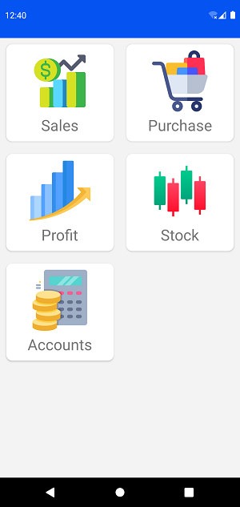
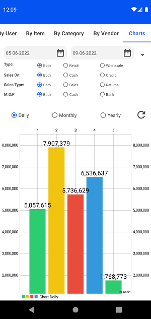
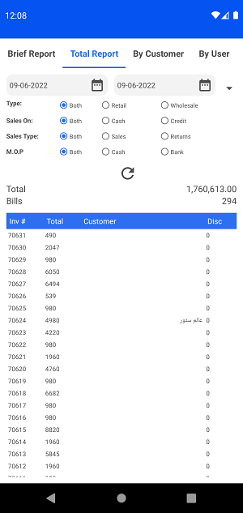
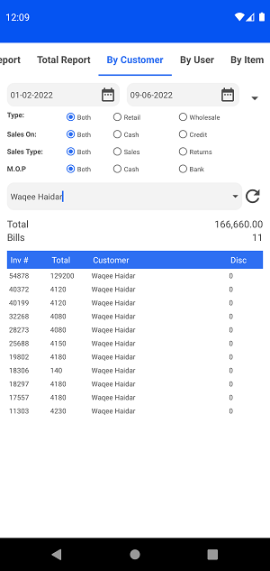
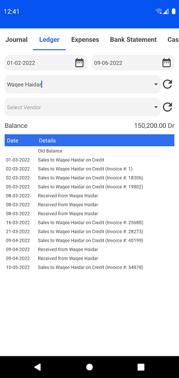
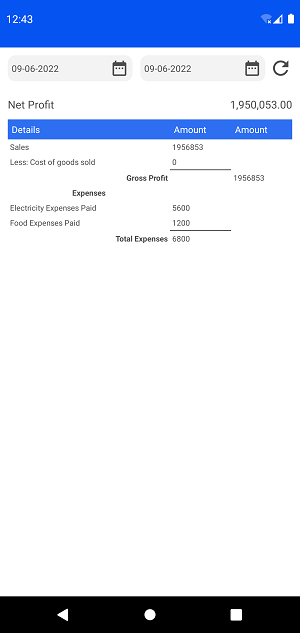
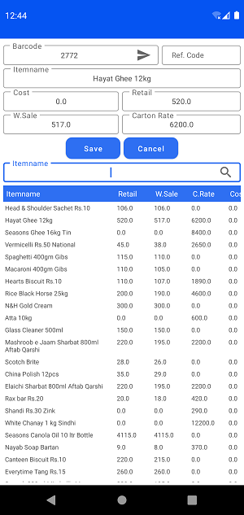

# StatsPOS-Reporting-App

Online Reporting App for StatsPOS Retail Software. 

## What I use

- Nodejs to Create API.
- Volley Library to Access API and get Data.
- MSSQL Server is used to Store Data.

## Screenshots

